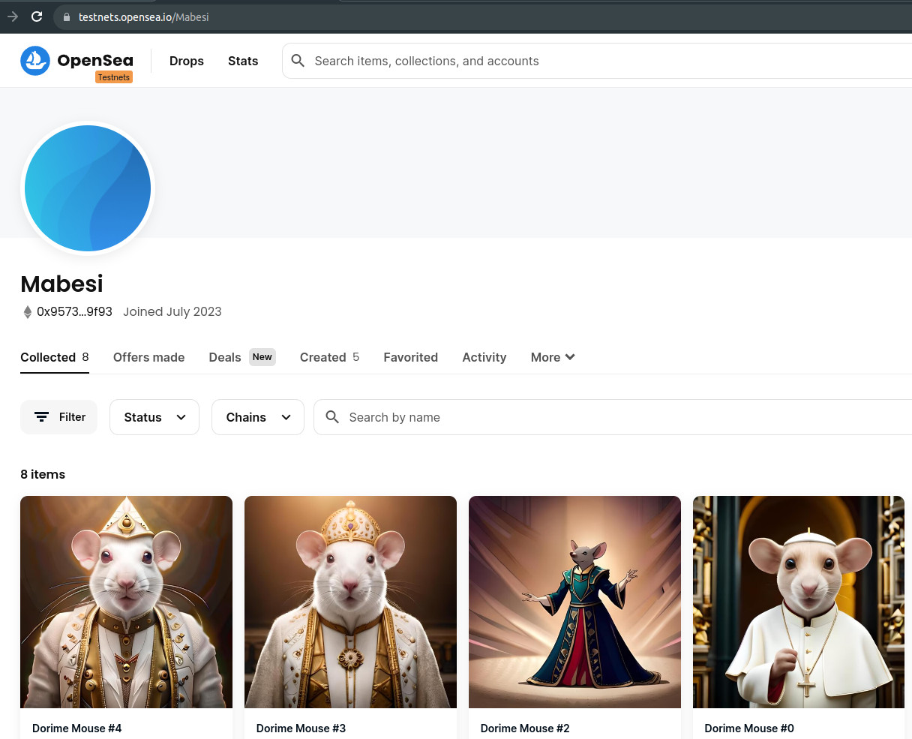

# MABESI AZUKI NFT DAPP

A frontend Web3 App for the [Mabesi Azuki NFT Collection](https://github.com/mabesi/azuki-nft) Smart Contract.

## :speech_balloon: Description

This DApp is a frontend built with React to serve as a user interface for Smart Contract that implements the [ERC-721A](https://www.erc721a.org) standard, Azuki's NFT standard, that supports minting multiple tokens for close to the cost of one.

<table>
    <tr>
        <td colspan='2'>
            <kbd>
                
            </kbd>
        </td>
    </tr>
    <tr>
        <td>
            
        </td>
        <td>
            
        </td>
    </tr>
<table>

## Table of contents

- [Features](#features)
- [Built With](#built-with)
- [Getting Started](#getting-started)
  - [Prerequisites](#prerequisites)
  - [Installation](#installation)
  - [Configuration](#configuration)
  - [Deploy](#deploy)
  - [Testing](#testing)
  - [Usage](#usage)
  - [Troubleshooting](#troubleshooting)
- [Back Matter](#back-matter)
  - [Acknowledgements](#acknowledgements)
  - [See Also](#see-also)
  - [Contributing](#contributing)
  - [Authors & Contributors](#authors-&-contributors)
  - [Legal Disclaimer](#legal-disclaimer)
  - [License](#license)

## Features

These are the key features of the tool:

- Feature 1: lorem ipsum
- Feature 2: lorem ipsum.
- Feature 3: lorem ipsum.

## Built With

- Tecno 1
- Tecno 2
- Tecno 3

## Getting Started

### Prerequisites

- Pre 1
- Pre 2

### Installation

Clone the repository on your local machine and enter the project folder:

```bash
$ git clone git@github.com:/ORG/PROJECT.git
$ cd PROJECT
```
Install the dependencies using npm:

```bash
$ npm install
```

Or yarn:

```bash
$ yarn install
```

### Configuration

Clone the `.env.example` file into a new `.env` file and adjust the values as described below, according to your environment.

```js
//ENV_VARIABLE_01=valor1
ENV_VARIABLE_01=

//ENV_VARIABLE_02=valor2
ENV_VARIABLE_02=
```

### Deploy

To deploy the project follow these steps:

1. Step 1
2. Step 2

### Testing

Run the test command, like this:

```bash
$ npm test
```

### Usage

The instructions to use the project functionalities.

Run the development server:

```bash
$ npm run dev
```
Or
```bash
$ yarn dev
```

Open [http://localhost:3000](http://localhost:3000) with your browser to see the result.

### Troubleshooting

The instructions to troubleshooting the project problems.

## Back Matter

### Acknowledgements

Thanks to all these amazing people and tools that served as a source of knowledge or were an integral part in the construction of this project.

- [1](https://www.1.com/) - 1 item or person
- [2](https://www.2.com/) - 2 item or person

### See Also

- [Also 1](https://www.also1.com)
- [Also 2](https://www.also2.com)

### Contributing

Please read [CONTRIBUTING.md](CONTRIBUTING.md) for details on our code of conduct, and the process for submitting pull requests to us.

1.  Fork it!
2.  Create your feature branch: `git checkout -b my-new-feature`
3.  Add your changes: `git add .`
4.  Commit your changes: `git commit -am 'Add some feature'`
5.  Push to the branch: `git push origin my-new-feature`
6.  Submit a pull request :sunglasses:

### Authors & Contributors

| [<br><sub>Jonh Doe</sub>](https://github.com/jonhdoe) | [<br><sub>Jane Doe</sub>](https://github.com/janedoe) |
| :---: | :---: |

### Legal Disclaimer

<p align="justify">The use of this tool, for any purpose, will occur at your own risk, being your sole responsibility for any legal implications arising from it.</p>
<p align="justify">It is also the end user's responsibility to know and obey all applicable local, state and federal laws. Developers take no responsibility and are not liable for any misuse or damage caused by this program.</p>

### License

This project is licensed under the [MIT License](LICENSE.md).
